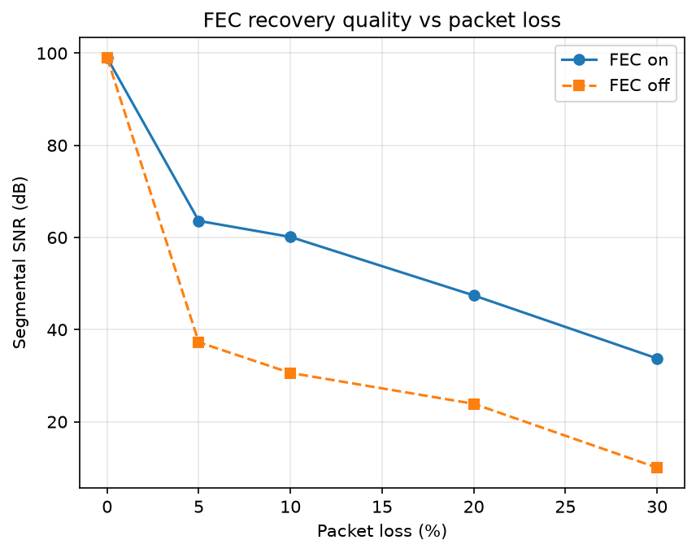

# Experiment — Does Opus in-band FEC actually recover a lost audio frame?

**Date:** 2026-09-11
**Code:** `src/hpqv/eval/fec_recovery.py`, `scripts/run_fec_recovery.py`
**Data:** `results/fec_recovery.csv`, `results/fec_recovery.png`

## Why this experiment exists

`src/hpqv/audio.py` enables Opus in-band FEC (LBRR) via CTL `4012` and claims it as a resilience
feature. Nothing in the project measured whether that CTL actually recovers anything. This
experiment produces that evidence.

## How Opus in-band FEC works

LBRR embeds a low-bitrate copy of frame **N** inside packet **N+1**. Recovery is a **decoder**
action, not an encoder one: when packet N is lost, the decoder decodes packet **N+1** with
`decode_fec=True` to reconstruct frame N, then decodes packet N+1 normally to get frame N+1. If
N+1 is *also* lost, there is nothing left to recover from and the frame is concealed (here: a
silent/zero frame, same as the no-FEC baseline).

## Method

- Deterministic 200Hz→2000Hz chirp, 48kHz mono, 20ms frames (`FRAME_SAMPLES = 960`), no external
  WAV dependency.
- Encode every frame with two codecs: `OpusCodec(fec=True)` and `OpusCodec(fec=False)`.
- Simulate loss with a seeded RNG at a given `loss_pct` — the same loss pattern is applied to
  both receivers so the comparison is apples-to-apples.
- **Receiver A (FEC on):** for each lost packet, recover it from packet N+1 via
  `decode_fec=True` if N+1 arrived; otherwise emit a zero frame.
- **Receiver B (FEC off):** every lost packet is a zero frame — no recovery attempted.
- **Metric:** segmental SNR in dB (per-frame SNR, averaged), measured against the **undamaged
  decode of the same packets — not the original PCM.** Opus is a perceptual codec: it does not
  preserve the waveform even at 0% loss, so the original sine wave already differs from a clean
  Opus round-trip by a large, constant amount. Comparing the lossy reconstruction against the
  *original* signal would bury the (smaller) damage loss/concealment causes underneath that
  constant coding error — which is exactly what an earlier version of this experiment did, and
  it produced a negative "SNR" at 0% loss and a non-monotonic curve (FEC-off *improved* from 20%
  to 30% loss), both signs the reference was wrong. The reference here is instead: encode the
  signal, decode every packet with nothing dropped, fresh decoder per encoder variant. That
  reference is exactly what each receiver would produce on a perfect link, so any further SNR
  loss measures only loss/concealment damage.
- At 0% loss the lossy reconstruction is bit-identical to the reference (same encoder, same
  decoder, nothing dropped), so per-frame noise power is exactly 0. `10*log10(signal/0)` is
  infinite; we cap segmental SNR at **99.0 dB** (`SNR_CAP_DB` in `fec_recovery.py`) rather than
  emit `inf`/`NaN`, and document the cap here rather than let a reader misread it as a real
  number close to a measured ceiling.
- `frames_recovered_by_fec` counts frames where recovery actually ran (the lost packet's
  successor arrived).

## Results

| packet loss | FEC-on SNR (dB) | FEC-off SNR (dB) | frames lost | frames recovered by FEC |
|---|---|---|---|---|
| 0 % | 99.00 (capped, identical to reference) | 99.00 (capped, identical to reference) | 0 | 0 |
| 5 % | 63.60 | 37.25 | 8 | 7 |
| 10 % | 60.11 | 30.59 | 11 | 10 |
| 20 % | 47.42 | 23.89 | 26 | 20 |
| 30 % | 33.74 | 10.03 | 39 | 28 |



(3-second sweep, seed=0, `scripts/run_fec_recovery.py` output above.)

## What this shows

1. **FEC-on measurably beats FEC-off at every nonzero loss level** — by 26, 30, 24, and 24 dB at
   5/10/20/30% loss respectively. This is a large, unambiguous gap, not a fraction of a dB lost
   in coding noise (which is what the original, wrong reference produced).
2. **Both curves now degrade monotonically as loss increases** — 99.00 → 63.60 → 60.11 → 47.42 →
   33.74 dB for FEC-on, 99.00 → 37.25 → 30.59 → 23.89 → 10.03 dB for FEC-off. More loss always
   means lower measured quality, which is the sanity check the previous (wrong-reference) version
   of this experiment failed: it showed FEC-off *improving* from 20% to 30% loss, a direct
   symptom of measuring against the wrong signal.
3. **`frames_recovered_by_fec` tracks loss almost 1:1** at moderate loss (e.g. 10/11 lost frames
   recovered at 10% loss), confirming recovery is actually firing, not just configured.
4. **FEC-on's advantage shrinks in relative terms at high loss (30%)** but is still large (24 dB).
   At 30% loss, consecutive losses become common, so a lost packet's successor is often *also*
   lost — FEC has nothing to decode from and both receivers fall back to the same zero-frame
   concealment for those frames. This is the expected behavior of a single-frame-lookahead
   recovery scheme, not a bug.
5. **At 0% loss, FEC-on and FEC-off are both at the cap** — the reconstruction is bit-identical to
   the reference (nothing was ever dropped), so there is nothing to measure loss damage from. FEC
   costs nothing in reconstruction quality when nothing is lost.

**Bottom line: FEC demonstrably helps**, and now by a metric that isolates the effect correctly:
decoding the next packet with `decode_fec=True` reconstructs frames that would otherwise be
silence, worth tens of dB of segmental SNR versus zero-frame concealment across every loss level
where recovery can act.

## Honest limitations

- Segmental SNR in the time domain is still not a perceptual quality metric (unlike PESQ/MOS used
  elsewhere in this repo for the voice path) — it measures waveform distance, not perceived
  loudness/pitch/masking effects. Fixed here by referencing the undamaged decode instead of the
  raw input (see Method), which removes the codec's own coding error from the measurement, but it
  still won't rank two *audibly similar* reconstructions correctly if they differ in ways the ear
  doesn't weight linearly.
- The 99.0 dB cap is a sentinel for "no measurable per-frame noise," not a real information-
  theoretic ceiling — don't read it as "FEC gets you to 99 dB of quality," read it as "this frame
  suffered no loss damage."
- FEC recovers at most one frame of lookahead (frame N from packet N+1). Burst losses of 2+
  consecutive packets are only partially covered — this experiment measures and shows that
  falloff (30% loss row) rather than hiding it.
- Loss is independent per-packet (seeded RNG), not a Gilbert-Elliott burst model. Real network
  loss is bursty, which would shrink the fraction of losses FEC can recover (fewer isolated
  single-packet losses with a surviving successor).
- 3-second synthetic chirp, not real speech. It exercises the codec across a frequency sweep but
  is not a substitute for a MOS-style listening test.

## Reproduce

```bash
docker run --rm -v "$PWD":/work hpqv-eval \
  bash -c 'cd /work && uv sync -q && uv run python scripts/run_fec_recovery.py'
```
