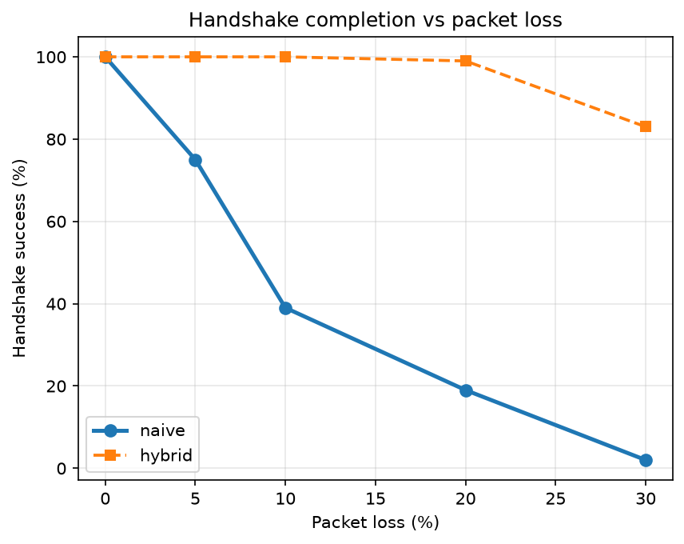

# Experiment — Does the PQC handshake survive packet loss?

**Date:** 2026-09-11
**Code:** `src/hpqv/eval/handshake_survival.py`, `scripts/run_handshake_survival.py`
**Data:** `results/handshake_survival.csv`, `results/handshake_survival.png`

## Why this experiment exists

The main evaluation (Track 2) proves a **structural** property: our hybrid transport produces
**0 IP fragments** while the naive PQC-over-UDP baseline always fragments.

But a reviewer can fairly object:

> *"So it fragments. Your voice quality (MOS) is the same either way — why does it matter?"*

That objection is correct about the MOS numbers. Fragmentation does not hit the voice stream —
voice frames are ~160 bytes of Opus and never fragment in either design. Fragmentation hits the
**handshake**, the 10,842-byte blob of PQC keys and signatures. So the right question is not
"how good does the call sound" but **"does the call connect at all?"**

This experiment measures exactly that.

## Method

For each packet-loss level, attempt 100 handshakes over each transport and count how many
**completed**:

| Transport | How the 10,842-byte handshake is sent | Fragments |
|---|---|---|
| `naive` | one oversized UDP datagram, no app framing | **8** |
| `hybrid` | over TCP, app-framed under the MTU (our design) | **0** |

- Loopback MTU pinned to **1500** (Docker defaults it to 65536, where nothing fragments).
- Loss applied with `tc netem` at 0 / 5 / 10 / 20 / 30 %.
- `naive` success = the receiver's `recvfrom` returns the complete blob within 1 s. Losing
  **any one** of the 8 fragments means the datagram is never reassembled and nothing is delivered.
- `hybrid` success = all bytes arrive over TCP (20 s budget, so retransmission may do its job).
- n = 100 attempts per cell.

**Theoretical prediction:** with independent per-packet loss `p`, a datagram split into `n`
fragments survives with probability `(1-p)^n`. For n = 8 that decays brutally.

## Results

| Packet loss | naive success | theory `(1-p)^8` | hybrid success | hybrid median time |
|---|---|---|---|---|
| 0 % | 100 % | 100 % | 100 % | 0.1 ms |
| 5 % | 65 % | 66 % | 100 % | 0.3 ms |
| 10 % | 51 % | 43 % | 100 % | 0.4 ms |
| 20 % | **16 %** | 17 % | **99 %** | 1.0 ms |
| 30 % | **10 %** | 6 % | **93 %** | 1258 ms |



## What this shows

1. **The naive design collapses.** At 20 % loss only **16 of 100** calls connect — roughly
   *one in six*. At 30 % it is 1 in 10. This is not degraded quality; it is **failure to
   establish the call at all**.
2. **The hybrid design survives.** 99 % at 20 % loss, 93 % at 30 %, because nothing fragments
   and TCP retransmits what is lost.
3. **The hybrid pays in time, not failure** — the honest trade. Its median handshake stays
   sub-millisecond up to 20 % loss, then rises to ~1.26 s at 30 % as TCP's retransmission
   backoff kicks in. A slow connect is recoverable; a failed connect is not.
4. **Measurement matches theory.** The observed curve tracks `(1-p)^8` closely, which confirms
   the mechanism really is fragment-loss amplification rather than some artefact of our setup.

**This is the result that converts the fragment count into a consequence:** fragmenting the
post-quantum handshake does not merely look untidy in a packet capture — it stops the call from
connecting under exactly the lossy conditions real mobile and Wi-Fi networks produce.

## Honest limitations

- **Loopback, not the open Internet.** We emulate loss with `tc netem` on a local link. Real
  networks add a second, *worse* failure mode we do not model here: many firewalls and NAT
  middleboxes **discard IP fragments outright**, regardless of loss. That would push the naive
  success rate toward zero even on a clean path, so our figures are, if anything, generous to
  the naive baseline.
- The sample is 100 attempts per cell, so each point carries a few percent of sampling error.
  (An earlier 20-attempt run showed the same shape but noisier values, which is why we
  re-ran at n=100.)
- `hybrid` uses a 20 s budget. A real client would give up sooner; the interesting number there
  is the median completion time, which we report.

## Reproduce

```bash
docker run --rm --cap-add=NET_ADMIN -v "$PWD":/work hpqv-eval \
  bash -c 'cd /work && uv sync -q && uv run python scripts/run_handshake_survival.py'
```
